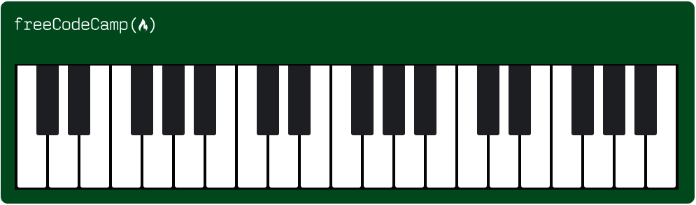

# 🎹 Basic Responsive Piano

A beginner-friendly HTML and CSS project that demonstrates **basic responsive design** principles by visually replicating a piano keyboard. It adjusts to different screen sizes using simple, effective layout techniques — ideal for showcasing entry-level responsive skills.



---

## 📁 Project Structure
```
    ├── images/
    │ └── preview.png # Screenshot of the rendered piano
    ├── index.html # Main HTML structure of the piano
    ├── styles.css # Responsive styles using pure CSS
    ├── README.md # Project documentation
    └── LICENSE # MIT License
```


---

## 🧩 Key Features

- 🎼 **Visually styled piano** with black and white keys
- 🖼️ **Logo placement** using absolute positioning
- 📱 **Responsive layout** with media queries for tablet and mobile
- 🎨 Clean and intuitive design with focus on layout and responsiveness
- 🧪 No JavaScript — just HTML and CSS for clarity and simplicity

---

## 🚀 Live Demo

Open `index.html` in any modern browser or deploy via GitHub Pages.


## 🧠 Responsive Design Highlights

- ✅ Viewport meta tag for mobile scaling
- ✅ Media queries at `768px` and `1199px` breakpoints
- ✅ Absolute positioning for elements like logo
- ✅ Adaptive resizing of piano container and keys

### 📱 Breakpoints

| Viewport Width | Piano Width | Keys Width | Logo Width |
|----------------|-------------|------------|------------|
| `< 768px`      | 358px       | 318px      | 150px      |
| `769–1199px`   | 675px       | 633px      | 200px      |
| `>= 1200px`    | 992px       | 949px      | 200px      |

---

## 🎯 Learning Objectives
- Understand float-based layout and its modern alternatives

- Practice media queries and responsive breakpoints

- Apply absolute positioning effectively

- Build a creative UI component using just HTML and CSS

## 🛠️ Potential Enhancements
- Add sound playback with JavaScript and Web Audio API

- Make keys interactive with hover/click effects

- Convert layout to CSS Grid or Flexbox

- Add labels to keys (A, B, C...)


## 📄 License
MIT License – see LICENSE file for details.


## 🙌 Acknowledgments
- Inspired by the freeCodeCamp Responsive Web Design curriculum

- Logo provided by freeCodeCamp (CDN-hosted)